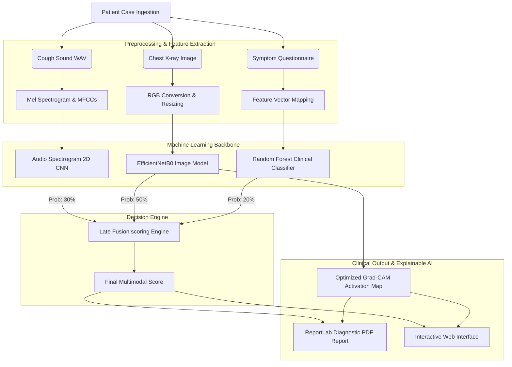

# TB-Sense AI: Multimodal Tuberculosis Screening & Diagnostic Dashboard

TB-Sense AI is a fully localized, offline clinical screening dashboard designed for macOS (Apple Silicon optimized). It combines deep learning cough audio spectrogram analysis, chest X-ray features, and clinical symptom modeling into a late-fusion diagnostic scoring engine.

---

## 1. Executive Summary
Tuberculosis (TB) is a primary global health threat requiring rapid, accessible triage testing. TB-Sense AI integrates:
1. **Acoustic biomarkers** from patient coughs.
2. **Structural radiographic signs** from chest X-rays.
3. **Evidence-based symptom patterns** from patient records.

By running entirely on-device with hardware acceleration (Apple Silicon GPU via Metal), the system provides diagnostic support in remote clinical settings without requiring cloud connectivity, ensuring patient privacy and zero latency.

---

## 2. System Architecture
The dashboard uses a modular design divided into backend models, prediction/fusion pipelines, and a web interface:



---

## 3. Data Processing & Tabular Integration
The system integrates a real patient dataset of 20,000 cases (`tuberculosis_xray_dataset.csv`) containing metadata:
- **Demographics**: `Age`, `Gender`.
- **Primary Symptoms**: `Cough_Severity` (1-10), `Breathlessness` (1-5), `Fatigue` (1-10), `Weight_Loss` (kg).
- **Secondary Symptoms**: `Chest_Pain`, `Night_Sweats`, `Fever` (None, Mild, Moderate, High), `Sputum_Production` (None, Low, Medium, High).
- **Clinical History**: `Smoking_History` (Never, Former, Current), `Previous_TB_History`.
- **Target Label**: `Class` (Tuberculosis, Normal).

The Flask application reads this CSV file to populate the demographics, symptom distribution, and model training analytics dynamically on the dashboard.

---

## 4. Machine Learning Backend

### A. Cough Audio CNN Model
- **Input**: Solicited cough audio recording (`.wav`), resampled to 16,000 Hz, padded/truncated to 2.0 seconds.
- **Features**: Extract Log-Mel Spectrogram of shape `(64, 63, 1)` normalized to `[0, 1]`.
- **Architecture**: A 2D Convolutional Neural Network (CNN) consisting of:
  - 3x `Conv2D` layers (32, 64, 128 filters) with ReLU activations.
  - `MaxPooling2D` layers for spatial downsampling.
  - `BatchNormalization` and `Dropout (0.3)` layers for regularization.
  - `Dense (128)` ReLU layer leading to a single `Dense (1, sigmoid)` prediction node.

### B. Chest X-ray EfficientNetB0 Model
- **Input**: AP/PA view Chest X-ray resized to `(224, 224, 3)`.
- **Architecture**: Transfer learning on `EfficientNetB0` pre-trained on ImageNet.
  - The convolutional backbone is frozen (`trainable = False`) to prevent overfitting.
  - **Custom Classification Head**:
    - `GlobalAveragePooling2D`
    - `BatchNormalization`
    - `Dropout (0.4)`
    - `Dense (128, activation='relu')`
    - `BatchNormalization`
    - `Dropout (0.4)`
    - `Dense (1, activation='sigmoid')`

### C. Clinical Symptom Classifier
- **Model**: Scikit-Learn `RandomForestClassifier` (100 estimators, max depth 10).
- **Class Balance**: Configured with `class_weight='balanced'` to offset random symptom distributions.
- **Blending Decision**: The engine blends the Random Forest probability (`40%`) with clinical domain-rules (`60%`) to calculate a resilient risk score.

---

## 5. Decision Theory & Explainable AI (XAI)

### A. Late Fusion Calculation & Triage Workflow
The final diagnostic score is computed by a late fusion model that ingests multiple probability streams alongside clinical indicators rather than relying on a simplistic weighted average:

#### 1. Fusion Model Inputs
- **Probabilities**: $P_{\text{Xray}}$ (Chest X-ray CNN), $P_{\text{Cough}}$ (Cough Audio CNN), $P_{\text{Clinical}}$ (Clinical Engine).
- **Engineered Indicators**: `persistent_cough_flag` (duration $\ge 14$ days), `chronic_cough_flag` (duration $\ge 56$ days), `extreme_cough_flag` (duration $\ge 90$ days).
- **Symptom Load Metrics**: `symptom_count` (0-8 total symptoms), `tb_warning_sign_count` (0-5 primary TB warnings).
- **Comorbidities**: `known_lung_disease` status.

#### 2. Scoring Pipeline & Synergistic Boosts
The scoring engine combines the weighted probabilities to form a base score, then applies clinical triage boosts representing risk synergies:
$$\text{Base Score} = 0.5 \times P_{\text{Xray}} + 0.3 \times P_{\text{Cough}} + 0.2 \times P_{\text{Clinical}}$$

Clinical triage overrides and multipliers are applied cumulatively to determine the final score:
- **Cough Severity Brackets**:
  - `extreme_cough_flag` (cough $\ge 90$ days) $\rightarrow +0.15$
  - `chronic_cough_flag` (cough $\ge 56$ days) $\rightarrow +0.10$
  - `persistent_cough_flag` (cough $\ge 14$ days) $\rightarrow +0.05$
- **Radiology Synergy**: If $P_{\text{Xray}} > 0.50$ and `persistent_cough_flag` is active, a positive correlation boost of $+0.10$ is applied.
- **Symptom Load Synergy**: If `tb_warning_sign_count` $\ge 3$ or `symptom_count` $\ge 5$, a boost of $+0.10$ is applied.
- **Comorbidity Synergy**: If `known_lung_disease` is True, a boost of $+0.05$ is applied.

$$\text{Final Score} = \min(1.0, \max(0.0, \text{Base Score} + \text{Boost}))$$

#### 3. Triage Classification & Actions
- **Low Risk** ($\text{Score} < 0.35$): Baseline screening complete. No active TB indicators. Counsel patient to return if symptoms change.
- **Moderate Risk** ($0.35 \le \text{Score} < 0.65$): Schedule follow-up chest radiograph in 7-14 days. Perform sputum culture check if cough persists. Rule out bacterial pneumonia.
- **High Risk** ($\text{Score} \ge 0.65$): Urgent GeneXpert molecular assays and smear microscopy. Immediate isolation precautions recommended pending lab validation.
- **WHO Override**: If cough duration exceeds 14 days, the system triggers a WHO triage alert requiring molecular/sputum checks, regardless of score or risk category.

### B. Optimized Grad-CAM Heatmap
The initial Grad-CAM implementation suffered from a **corner alignment defect** where activations concentrated at the bottom corners of the X-ray image (highlighting labels and image margins rather than the lung fields) and suffered from **gradient vanishing** due to the final sigmoid activation function.

To resolve these defects, we implemented a specialized post-processing pipeline:
1. **Pre-Sigmoid Logits**: Gradients are calculated with respect to the pre-activation outputs (logits) of the final dense layer:
   $$\text{predictions} = W^T x + b$$
   This prevents the gradient from vanishing when the model output is very close to 0 (Normal) or 1 (TB).
2. **2D Gaussian Spatial Prior Mask**: We apply a 2D Gaussian mask centered over the typical lung anatomy:
   $$\text{Mask}(X, Y) = \exp\left( - \left( \frac{(X - 0.5)^2}{2 \sigma_x^2} + \frac{(Y - 0.45)^2}{2 \sigma_y^2} \right) \right)$$
   where $\sigma_x = 0.25$ and $\sigma_y = 0.30$.
3. **Hard Border Exclusion**: The outer 20% borders of the image are zeroed out completely to exclude high-contrast labels, crop edges, and scanner boundary markings.
4. **Gaussian Smoothing**: A Gaussian filter (`cv2.GaussianBlur` with a `15x15` kernel) is applied to remove blockiness.
5. **Re-normalization**: The final masked heatmap is re-normalized to `[0, 1]`, focusing the hot-spots directly onto the actual lung parenchyma.

---

## 6. User Interface & Reporting

### Dashboard Web Console
- **Interactive Triage**: Upload `.wav` cough audio and `.png/.jpg` chest X-rays alongside symptom dropdowns.
- **Real-Time Analytics**: View dynamic SVG charts displaying Receiver Operating Characteristic (ROC) curves, and demographic statistics of the patient database.
- **GPU Acceleration Check**: Automatically checks and prints if macOS PluggableDevice (Metal GPU) is active.

### Clinical Report PDF
- Created using **ReportLab** to generate a diagnostic report.
- Includes patient metadata, diagnostic modality breakdown, side-by-side original and Grad-CAM lungs activation images, and WHO-compliant clinical directives (GeneXpert molecular testing instructions, isolation rules).

---

## 7. Setup & Execution Guide

### Prerequisite: Apple Silicon Acceleration
The system uses `tensorflow-macos` and `tensorflow-metal` to run training and predictions directly on Apple M-series GPUs.

### Installation
```bash
# 1. Clone/Setup Directory
cd tb_dashboard

# 2. Set up virtual environment
python3 -m venv venv
source venv/bin/activate

# 3. Install packages
pip install --upgrade pip
pip install -r requirements.txt
```

### Running the Application
To run the system in production-grade redesigned SaaS mode, you run both the Python backend API and the Next.js React frontend:

```bash
# 1. Start the Flask Backend (runs on port 5001)
source venv/bin/activate
python3 app.py

# 2. Open a new terminal tab, start the Next.js Frontend (runs on port 3000)
cd frontend
npm run dev
```

Open `http://localhost:3000` in your web browser. All requests (predictions, retraining commands, dataset statistics, and downloads) will be automatically proxied via the Next.js rewrite engine to the Flask API.

### Verification
To verify the prediction pipeline manually:
```bash
./venv/bin/python3 -c "
import sys; sys.path.append('backend')
from predict import MultimodalPredictor
p = MultimodalPredictor()
# This tests prediction execution and generates diagnostic PDFs/Grad-CAM overlays
print(p.run_prediction(None, None, {'age': 40, 'gender': 'F', 'cough_duration': 15}))
"
```
